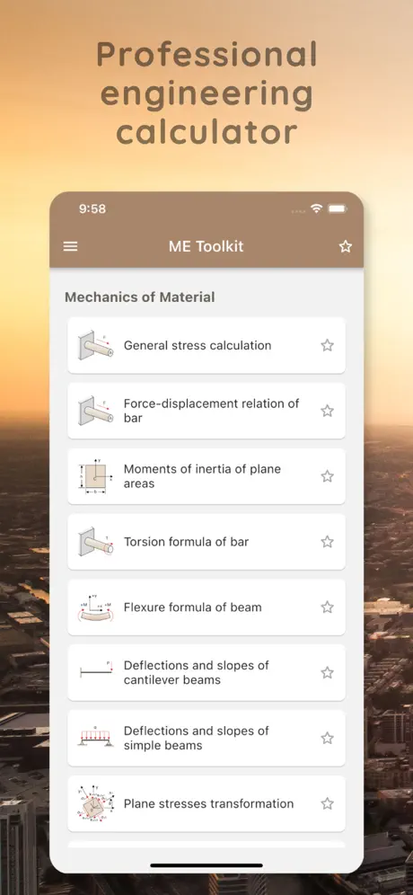
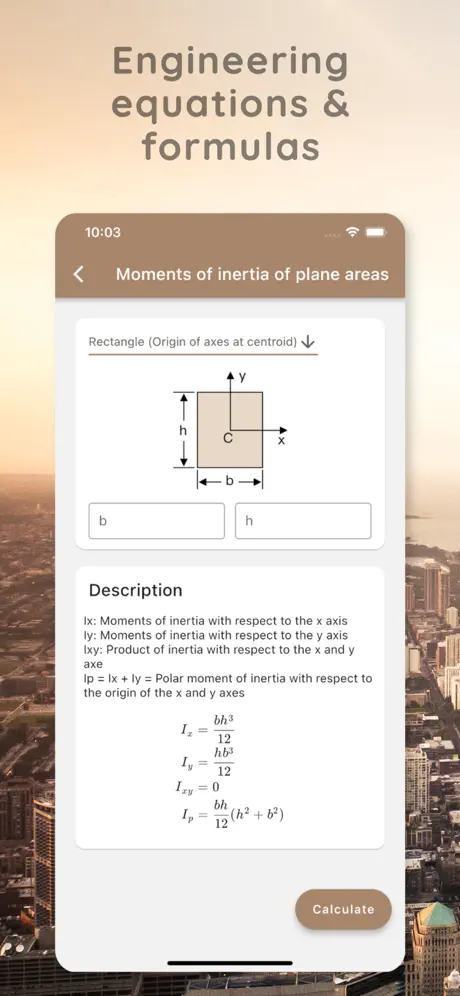
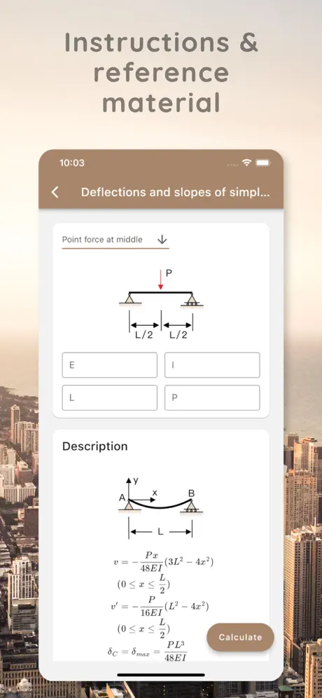

# 🛠️ Mechanical Engineering Toolkit

[](https://apps.apple.com/lb/app/mechanical-engineering-toolkit/id1601099443?platform=iphone)

## 📖 Overview

**Mechanical Engineering Toolkit** is a professional engineering calculator designed for students, researchers, and industrial engineers. This toolkit offers a wide range of engineering equations, formulas, calculation tools, instructions, and reference material. Users can easily calculate results by selecting a formula and entering the required variables.

## 📱 Screenshots

<p align="center">
  
  
  
</p>

## ✨ Features

- 🔢 **Comprehensive Formula Library** - Access a vast collection of engineering formulas and calculations
- ⚡ **Quick Calculations** - Instantly compute results by entering variables into provided formulas
- 📚 **Educational Resources** - Detailed instructions and reference material for various engineering disciplines
- 🎯 **Professional Grade** - Suitable for university students, researchers, and industry professionals
- 📱 **Cross-Platform** - Built with Flutter for consistent experience across devices
- 🌍 **Internationalization** - Support for multiple languages (English, Chinese)
- 💾 **Favorites System** - Save frequently used calculations for quick access
- 🎨 **Modern UI** - Clean, intuitive interface designed for engineering workflows

## 🧮 Available Categories

### 1. ⚙️ Mechanics of Material
- **Moments of inertia of plane areas**
- **Force-displacement relation of bar**
- **Torsion formula of bar**
- **Flexure formula of beam**
- **Deflections and slopes of cantilever beams**
- **Deflections and slopes of simple beams**
- **Plane stresses transformation**
- **Principal stresses and planes**
- **Stresses in the wall of a spherical shell**
- **Stresses in a thin-walled cylindrical pressure vessel**
- **Buckling load of column**

### 2. 🧱 Theory of Elasticity
- **Constitutive relation of linear elastic material**
- **Stress/strain of linear elastic material**

### 3. 🌐 Composite Material
- **Lamina stress/strain**
- **Lamina engineering constants**
- **Laminate stress/strain**
- **Laminate plane properties**
- **Laminate 3D properties**
- **Rule of mixtures**
- **Composite failure criteria (Tsai-Hill / Tsai-Wu)**

### 4. ⚙️ Machine Design
- **Helical compression spring** (rate, Wahl factor, natural frequency)
- **Spur gear geometry** (pitch diameters, Lewis bending stress, contact stress estimate)
- **Shaft fatigue design** (DE-Goodman diameter sizing)
- **Bearing L10 life**
- **Belt / chain drive** (ratio, length, wrap angle)
- **Bolt preload / torque-tension**
- **Fillet weld strength**
- **Press / shrink-fit interference**

### 5. 💧 Fluids & Thermal
- **Reynolds number & flow regime** (laminar / transitional / turbulent)
- **Pipe pressure drop** (Darcy–Weisbach, Colebrook friction factor, minor losses)
- **Pump & fan power** (hydraulic and shaft power, head)
- **Composite wall conduction** (layer resistances, U value, interface temperatures)
- **Fin efficiency** (straight rectangular fin, corrected length)
- **Heat exchanger (LMTD)** (counter / parallel flow, required area)

### 6. 📐 Reference Tables
- **Drill & tap chart**
- **ISO 286 fits & tolerances**
- **Standard sections** — AISC W shapes plus European IPE and HEB, with dimensions, area, second moments, section moduli and radii of gyration

*(This list covers the major categories; the in-app search finds every tool by name or keyword — see [tool_model.dart](lib/home/tool_model.dart) for the full, current registry.)*

## 🛠️ Technical Information

This project is built using **Flutter** and **Dart**.

- **Flutter SDK**: `3.44.2`
- **Dart SDK**: `>=3.0.0 <4.0.0`

## 🚀 Getting Started

### Prerequisites

Before you begin, ensure you have the following installed:
- [Flutter SDK](https://flutter.dev/docs/get-started/install) (version 3.44.2 or higher)
- [Dart SDK](https://dart.dev/get-dart) (version 3.0.0 or higher)
- [Android Studio](https://developer.android.com/studio) or [VS Code](https://code.visualstudio.com/)
- [Git](https://git-scm.com/)

### Installation

1. **Clone the repository:**
```bash
git clone https://github.com/banghuazhao/mechanical-engineering-toolkit.git
cd mechanical-engineering-toolkit
```

2. **Check Flutter installation:**
```bash
flutter doctor
```

3. **Install dependencies:**
```bash
flutter pub get
```

4. **Run the app:**
```bash
flutter run
```

### Building for Production

Release builds read their AdMob IDs, signing config, and version from the
following files. The **untracked** ones are not in this repository — restore
them from your secret backup before building:

Untracked (restore before building):

- `lib/util/secrets.dart` — production AdMob **ad unit** IDs (banner + app-open,
  per platform). Consumed by `AdsManager`; Google **test** unit IDs are used
  automatically in debug builds only.
- `android/local.properties` — `AdMobAppId` (Android AdMob **app** ID, injected
  into the manifest as `com.google.android.gms.ads.APPLICATION_ID`) plus
  `flutter.versionName` / `flutter.versionCode`. If `AdMobAppId` is missing the
  build falls back to a Google **test** app id, so keep this file present.
- `android/key.properties` + the referenced keystore — release signing.

Tracked (already in the repo, nothing to restore):

- `ios/SecretsRelease.xcconfig` / `ios/SecretsDebug.xcconfig` — the AdMob
  **app** ID (`GADAPP_ID`), wired into `Info.plist`'s `GADApplicationIdentifier`
  as the project-level base xcconfig. These are committed: an AdMob app ID is
  not a secret (it ships inside every build's `Info.plist`), so there is no
  backup step for iOS.

iOS plugins are managed by **Swift Package Manager**, not CocoaPods — there is
no `Podfile` and no `ios/Pods` directory, and `flutter build ipa` resolves
plugin packages through Xcode's SPM integration.

Then build the store artifacts:

```bash
# Android App Bundle (signed release)
flutter build appbundle --release

# iOS App Store IPA (archive + export)
flutter build ipa --release
```

## 🧩 Adding a New Calculator

New tools should follow the pattern used by recent additions (e.g.
[`bolted_joint_page.dart`](lib/home/mechancs_of_material/page/bolted_joint_page.dart)
+ [`bolted_joint_result_page.dart`](lib/home/mechancs_of_material/page/bolted_joint_result_page.dart),
or [`centroid_page.dart`](lib/home/statics/page/centroid_page.dart)) rather than the
older per-tool `model/` + `widget/…Row.dart` split. All Mechanics of
Material and Beam Engineering tools have been migrated to this pattern; the
2 Theory of Elasticity tools and 6 Composite Material tools are still on the
older split (their matrix-heavy UIs make that a bigger, separate migration) —
follow the current pattern for anything new in those areas too, but don't be
surprised to find the older style there today.

### File layout

- One input page: `lib/home/<category>/page/<tool>_page.dart`
- One result page: `lib/home/<category>/page/<tool>_result_page.dart`
- Register the tool as a `Tool` entry in `lib/home/tool_model.dart`
  (`ToolLibrary.getTools`), using the next free id in the category's block:
  `100s` Mechanics of Material · `200s` Theory of Elasticity · `300s` Composite
  Material · `400s` Statics · `500s` Utilities.

### Checklist — every new calculator must

1. **Respect the unit system.** Every physical input/output must use
   [`UnitField`](lib/util/unit_field.dart) with a `UnitCategory` from
   [`units.dart`](lib/util/units.dart) (add a new category there if none fits).
   Never hardcode a unit string — `UnitField` shows the right suffix and
   converts in place based on `UnitSystemPreference`, and the user can switch
   between SI and Imperial from Settings at any time.
2. **Have an appropriate icon.** Give the `Tool` entry in `tool_model.dart`
   either `icon: Icons.…` (a Material *rounded* icon, matching existing
   entries) or `image: AssetImage('images/...')` pointing at a purpose-made
   asset. Don't ship a tool with no visual identity.
3. **Explain itself with a description and formula.** The input page should
   state what the tool computes and show the governing formula — plain text,
   or rendered math via `flutter_math_fork`'s `Math.tex` — near the inputs, so
   the user understands what to enter without leaving the page.
4. **Respect precision settings.** Route every displayed value through
   `NumberPrecisionHelper.formatValue()` — directly, or via the shared
   `AppCopyableValue` / `UnitField` widgets, which already do this — so
   results honor the user's precision and display-format (auto / scientific /
   decimal / engineering) settings. Never hardcode `toStringAsFixed(n)` on a
   user-facing result.
5. **Show the calculation and make it shareable — as text and as an image.**
   The result page must display the calculation steps (formula with values
   substituted — see `CalculationCard`) and offer two share actions in
   `AppBar.actions`: `shareResult(toolName, lines)` (text) and
   `shareResultImage(exportKey, toolName)` (PNG screenshot), both from
   [`share_helper.dart`](lib/util/share_helper.dart). For the image share,
   wrap the page's `AppContent` in a `RepaintBoundary(key: _exportKey, ...)`
   and give the widget an (non-`const`) `final _exportKey = GlobalKey();`
   field — see `bolted_joint_result_page.dart` for the exact pattern.
6. **Include an illustration where it helps.** When a diagram clarifies the
   setup (beam loading case, cross-section, free-body diagram, sign
   convention, etc.), add an image under `images/` or a small custom-painted
   diagram. Not required when the formula is fully self-explanatory, but
   strongly preferred. For an x-vs-y curve (a beam moment/deflection diagram,
   etc.), use the shared [`XYDiagramCard`](lib/ui/xy_diagram_card.dart) rather
   than writing a new `CustomPainter`.
7. **Wire up the icon Hero animation.** Add `ToolResultHeader(tool: tool)` —
   with `final tool = ToolLibrary.shared.item(widget.toolId, context);` at the
   top of `build()` — as the *first* child of both the input page's list and
   the result page's list. Because `ToolResultHeader` already wraps its
   icon/image in a `Hero(tag: 'tool_icon_${tool.id}')`, and the list/grid
   tiles in `tool_page.dart` carry the matching tag, this alone makes the
   tool's icon fly from the list into the input page, then into the result
   page — no extra code needed. Skip only for tools with no natural
   single-result moment (e.g. Unit Converter). List/grid entrance animation
   (`StaggeredEntrance`) and result-value fade transitions
   (`AppCopyableValue`) are automatic from the shared widgets — nothing to do
   for those beyond using the widgets as normal.

### Also expected of every new tool

- Record successful calculations with
  `context.read<ToolHistory>().record(widget.toolId, inputs: {...})`, and
  parse the same keys back out of `widget.initialInputs` in `initState`, so
  History and Favorites re-entry works.
- Build the UI from the shared design system —`AppContent`, `AppSectionCard`,
  `AdaptiveFieldGrid`, `AppCopyableValue`, and `context.tokens` for
  spacing/radius — rather than raw `Card`/`Padding` with magic numbers.
- Add a settings icon (`Icons.settings_rounded` → `ToolSettingPage`) and the
  `AppBannerAd` (`bottomNavigationBar: const AppBannerAd()`) to the result
  page, matching other tools — `AppBannerAd` already no-ops once the user has
  purchased Remove Ads, so no extra gating logic is needed.
- Validate inputs and report problems via a `SnackBar` (throw a
  `FormatException` in `_calculate()` and catch it) instead of failing
  silently.
- If the tool takes an isotropic material property (E, G, yield/ultimate
  strength, density, ν), add a
  [`MaterialPresetButton`](lib/ui/material_preset_picker.dart) below the
  relevant fields so the user can pick a built-in or custom material instead
  of typing constants by hand. Not for composite lamina properties
  (E1/E2/G12/ν12) — those aren't covered by this picker.
- If the tool's formula is a simple, single-valued function of its inputs,
  add a [`ParameterSweepCard`](lib/ui/parameter_sweep_card.dart) to the result
  page letting the user drag one input across a range and see the effect on
  the output live. Skip it for tools that already show a full diagram (beam
  load analysis) or whose output isn't a single scalar (truss analysis,
  centroid, composite laminate matrices).
- Add a unit test for the pure calculation logic under `test/` when the math
  is non-trivial (see `truss_solver_test.dart`, `beam_calculators_test.dart`
  for style).
- Add the new tool to this README's [Available Categories](#-available-categories) list.
- Add the new tool's id to any relevant major(s) in
  [`major_recommendation.dart`](lib/home/major_recommendation.dart) — new
  tools are easy to forget here since nothing fails if you skip it, but
  "Recommended by Major" is a primary discovery path and silently misses
  anything not listed.

### A note on units: two internal conventions coexist

Most tools work in true SI (E in Pa, L in m) and convert only at the
`UnitField`/display boundary — see `simply_supported_beam_calculator.dart`.

A number of "quick formula" tools (column buckling, bar force-displacement,
angle of twist, beam flexure, etc.) instead keep everything in the
**mm–N–MPa** system: length in mm, force in N, moment in N·mm, stress in MPa,
second moment of area in mm⁴. In that system the raw numeric values from
`UnitCategory.length`/`.force`/`.momentSection`/`.stress`/`.momentOfInertia`
combine directly with no conversion factors (e.g. `σ = M·y/I` with M in
N·mm, y in mm, I in mm⁴ gives σ directly in MPa). If such a tool also takes
an elastic/shear modulus, keep the field as `UnitCategory.modulus` (GPa —
correct display, and what `MaterialPresetButton` provides), but **multiply
by 1000 at the point of use** to convert to the MPa-equivalent number the
rest of the mm/N formula expects (1 GPa = 1000 MPa) — see the `e * 1000` /
`g * 1000` calls in `column_buckling_load_page.dart` and
`angle_of_twist_page.dart`. Getting this wrong silently produces results off
by a factor of 1000, so when adding a new mm–N–MPa tool with a modulus
input, follow one of those two files as a template rather than re-deriving
the conversion from scratch.

## 🤝 Contributing

We welcome contributions from the community! Here's how you can help:

### How to Contribute

1. **Fork the repository**
2. **Create a feature branch** (`git checkout -b feature/AmazingFeature`)
3. **Commit your changes** (`git commit -m 'Add some AmazingFeature'`)
4. **Push to the branch** (`git push origin feature/AmazingFeature`)
5. **Open a Pull Request**

### What We're Looking For

- 🐛 **Bug fixes** - Help us squash bugs and improve stability
- ✨ **New features** - Add new engineering formulas or calculation tools
- 📚 **Documentation** - Improve code comments, README, or add tutorials
- 🌍 **Translations** - Help translate the app to more languages
- 🎨 **UI/UX improvements** - Enhance the user interface and experience
- ⚡ **Performance optimizations** - Make the app faster and more efficient

### Code Style

- Follow the existing code style and conventions
- Add comments for complex calculations
- Write meaningful commit messages
- Test your changes thoroughly

## 📲 Download

The Mechanical Engineering Toolkit is available on the App Store:

[](https://apps.apple.com/lb/app/mechanical-engineering-toolkit/id1601099443?platform=iphone)

## 📞 Contact

- **Developer**: [@banghuazhao](https://github.com/banghuazhao)
- **GitHub Issues**: [Report bugs or request features](https://github.com/banghuazhao/mechanical-engineering-toolkit/issues)
- **App Store**: [Rate and review the app](https://apps.apple.com/lb/app/mechanical-engineering-toolkit/id1601099443?platform=iphone)

## 📜 License

This project is licensed under the MIT License - see the [LICENSE](LICENSE) file for details.

---

<div align="center">
  <p>Made with ❤️ for the engineering community</p>
  <p>If this project helps you, please consider giving it a ⭐</p>
</div>


