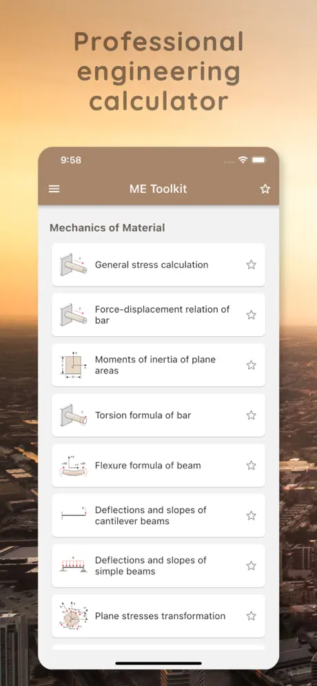
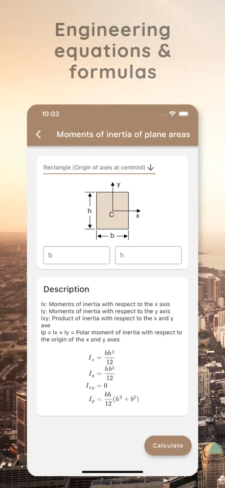
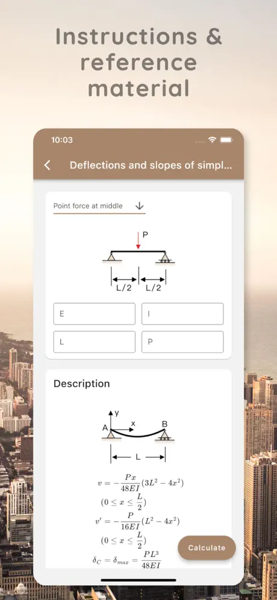

# 🛠️ Mechanical Engineering Toolkit

[](https://apps.apple.com/lb/app/mechanical-engineering-toolkit/id1601099443?platform=iphone)

## 📖 Overview

**Mechanical Engineering Toolkit** is a professional engineering calculator designed for students, researchers, and industrial engineers. This toolkit offers a wide range of engineering equations, formulas, calculation tools, instructions, and reference material. Users can easily calculate results by selecting a formula and entering the required variables.

<p align="center">
  
  
  
</p>

### ✨ Features:

- Access a comprehensive collection of engineering formulas and calculations.
- Quickly calculate results by entering variables into the provided formulas.
- Offers instructions and reference material for various engineering disciplines.
- Suitable for university, college students, researchers, and industry professionals.

## 🧮 Available Categories:

### 1. ⚙️ Mechanics of Material
- **Moments of inertia of plane areas**
- **Force-displacement relation of bar**
- **Torsion formula of bar**
- **Flexure formula of beam**
- **Deflections and slopes of cantilever beams**
- **Deflections and slopes of simple beams**
- **Plane stresses transformation**
- **Principal stresses and planes**
- **Stresses in the wall of a spherical shell**
- **Stresses in a thin-walled cylindrical pressure vessel**
- **Buckling load of column**

### 2. 🧱 Theory of Elasticity
- **Constitutive relation of linear elastic material**
- **Stress/strain of linear elastic material**

### 3. 🌐 Composite Material
- **Lamina stress/strain**
- **Lamina engineering constants**
- **Laminate stress/strain**
- **Laminate plane properties**
- **Laminate 3D properties**
- **Rule of mixtures**

## 🛠️ Technical Information

This project is built using **Flutter** and **Dart**.

- **Flutter SDK**: `>=3.19.0`
- **Dart SDK**: `>=3.3.0 <4.0.0`

### 🚀 Getting Started

To run the project locally, make sure you have the appropriate SDKs installed:

1. Clone the repository:
```bash
git clone https://github.com/banghuazhao/mechanical-engineering-toolkit.git
cd mechanical-engineering-toolkit
```

2. Install the dependencies:
```
flutter pub get
```

3. Run the App
```
flutter run
```

## 📲 Download
The Mechanical Engineering Toolkit is available on the App Store:

[Download from App Store](https://apps.apple.com/lb/app/mechanical-engineering-toolkit/id1601099443?platform=iphone)


## 📜 License
This project is licensed under the MIT License - see the [LICENSE](LICENSE) file for details.


